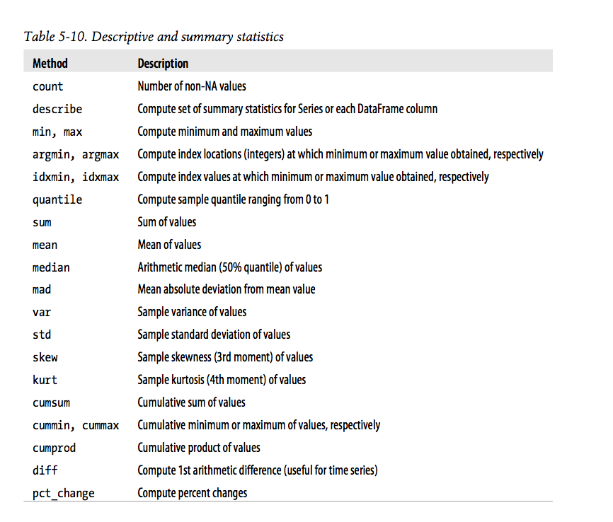
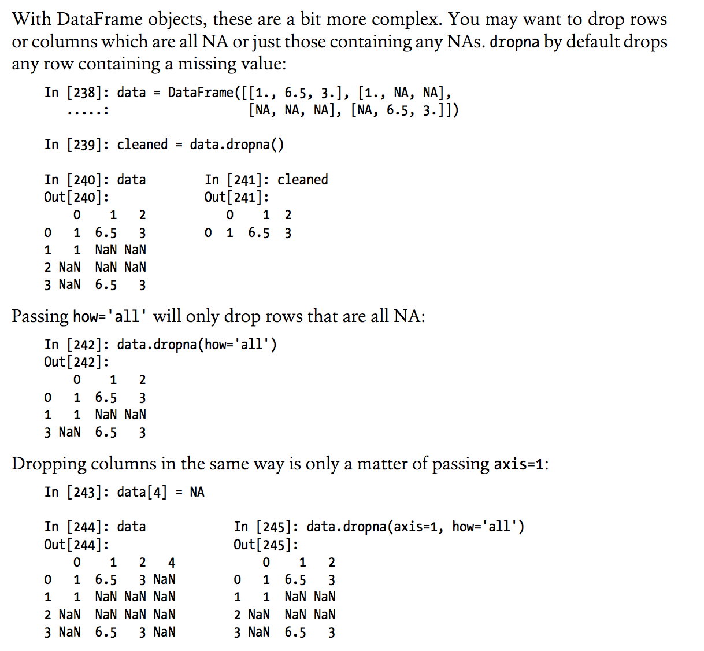
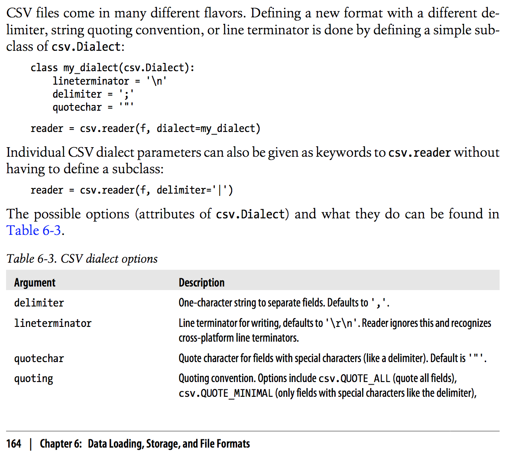
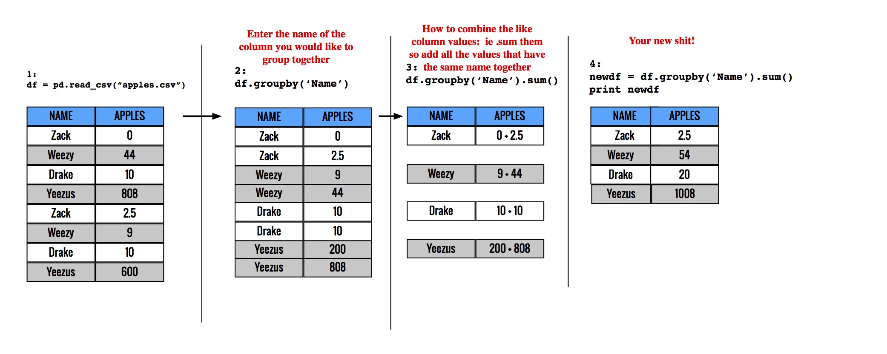

# `import pandas as pd`
### HOW TO CREATE A DATAFRAME

```python
In [1]: import pandas as pd

In [4]: alist = [1,2,3,4]

In [5]: another_list = ['a', 'b', 'c', 'd']

In [6]: mydict = {'col_one': alist, 'col_two': another_list}

In [8]: df = pd.DataFrame(mydict)
## or pd.DataFrame({'col_one': alist, 'col_two': another_list})

In [9]: df.head()
Out[9]:
   col_one col_two
0        1       a
1        2       b
2        3       c
3        4       d
```
### To add or append another column to your list
```python
## New data must be same length as dataframe it is going into.
In [11]: moredata = ['birdman', 'drake', 'lil wayne', 'kanye']

In [12]: df['rappers'] = moredata

In [13]: df.head()
Out[13]:
   col_one col_two    rappers
0        1       a    birdman
1        2       b      drake
2        3       c  lil wayne
3        4       d      kanye

```

### How to fill a new column with a value.
```python
In [19]: df['ones'] = 1

In [20]: df.head()
Out[20]:
   col_one col_two    rappers  ones
0        1       a    birdman     1
1        2       b      drake     1
2        3       c  lil wayne     1
3        4       d      kanye     1
```


### How to do math with your dataframe.
```python
In [21]: df['multi'] = df['col_one'] * df['ones']

In [22]: df.head()
Out[22]:
   col_one col_two    rappers  ones  multi
0        1       a    birdman     1      1
1        2       b      drake     1      2
2        3       c  lil wayne     1      3
3        4       d      kanye     1      4
```

### How to delete or drop a COLUMN from your dataframe
```python
In [23]: df = df.drop('rappers', axis=1)

In [24]: df.head()
Out[24]:
   col_one col_two  ones  multi
0        1       a     1      1
1        2       b     1      2
2        3       c     1      3
3        4       d     1      4

```
### How to delete or drop a ROW from your dataframe.
```python
In [25]: df = df.drop(0, axis=0)

In [26]: df.head()
Out[26]:
   col_one col_two  ones  multi
1        2       b     1      2
2        3       c     1      3
3        4       d     1      4
```
<br>

# Indexing is your new bff.
Indicies are just like columns, but for rows.  
```python
In [38]: ### HERE IS A DATAFRAME OF ALL THE 2012 BASEBALL HITTING STATS

In [39]: df.head(10)
Out[39]:
      playerID  yearID teamID   AB  HR
6    aardsda01    2012    NYA  NaN NaN
55    abadfe01    2012    HOU    7   0
220  abreubo01    2012    LAA   24   0
221  abreubo01    2012    LAN  195   3
227  abreuto01    2012    KCA   70   1
241  accarje01    2012    CLE    0   0
242  accarje01    2012    OAK  NaN NaN
247  aceveal01    2012    BOS    0   0
280  ackledu01    2012    SEA  607  12
298  acostma01    2012    NYN    0   0
```

### HOW TO SET YOUR INDEX

```python
# use the set_index function and pass in the name of the column you would like to set as the index

In [40]: df = df.set_index('teamID')

In [41]: df.head()
Out[41]:
         playerID  yearID   AB  HR
teamID
NYA     aardsda01    2012  NaN NaN
HOU      abadfe01    2012    7   0
LAA     abreubo01    2012   24   0
LAN     abreubo01    2012  195   3
KCA     abreuto01    2012   70   1
```


### HOW TO USE YOUR INDEX
Now that your index is set, you can easily return items that match your request.
```python
NOW YOU CAN EFFICIENTLY RETURN ALL VALUES THAT MATCH YOUR QUERY.

In [42]: df.ix['NYA']
Out[42]:
         playerID  yearID   AB  HR
teamID
NYA     aardsda01    2012  NaN NaN
NYA      canoro01    2012  627  33
NYA     cervefr01    2012    1   0
NYA     chambjo03    2012    0   0
NYA     chaveer01    2012  278  16
NYA     dickech01    2012   14   2
NYA     eppleco01    2012    0   0
NYA     garcifr02    2012    1   0
NYA     gardnbr01    2012   31   0
NYA     grandcu01    2012  596  43
NYA     hugheph01    2012    2   0
NYA     ibanera01    2012  384  19
NYA     igarary01    2012  NaN NaN
...

```
<br>

# Filters, masks, conditional selections and all that fun stuff.
What if you wanted to know all the people that had....
* More than 100 at bats
* More than 50 home runs
* In the years from 1980 to 2000.

```python
In [2]: df = pd.read_csv('data/baseball-csvs/Batting.csv')

In [3]: df.head()
Out[3]:
    playerID  yearID  stint teamID lgID   G  G_batting  AB  R  H  ...    SB  
0  aardsda01    2004      1    SFN   NL  11         11   0  0  0  ...     0
1  aardsda01    2006      1    CHN   NL  45         43   2  0  0  ...     0
2  aardsda01    2007      1    CHA   AL  25          2   0  0  0  ...     0
3  aardsda01    2008      1    BOS   AL  47          5   1  0  0  ...     0
4  aardsda01    2009      1    SEA   AL  73          3   0  0  0  ...     0


In [24]: condition1 = df['AB'] > 100

In [25]: condition2 = df['HR'] > 50

In [26]: condition3 = df['yearID'] < 2000

In [28]: condition4 =  df['yearID'] > 1980

In [29]: filtered_df = df[ condition1 & condition2 & condition3 & condition4 ]

Out[29]:
        playerID  yearID  stint teamID lgID    G  G_batting   AB    R    H  \
26613  fieldce01    1990      1    DET   AL  159        159  573  104  159
33249  griffke02    1997      1    SEA   AL  157        157  608  125  185
33250  griffke02    1998      1    SEA   AL  161        161  633  120  180
56911  mcgwima01    1996      1    OAK   AL  130        130  423  104  132
56914  mcgwima01    1998      1    SLN   NL  155        155  509  130  152
56915  mcgwima01    1999      1    SLN   NL  153        153  521  118  145
81928   sosasa01    1998      1    CHN   NL  159        159  643  134  198
81929   sosasa01    1999      1    CHN   NL  162        162  625  114  180

```
___
<br>

<br>
# The illusive timestamp
`df['date_time_object'] = pd.to_datetime(df['the date col'])` Works 72% of the time.
```python
In [41]: df = df[['yearID', 'playerID', 'teamID']]

In [42]: df.head()
Out[42]:
   yearID   playerID teamID
0    2004  aardsda01    SFN
1    2006  aardsda01    CHN
2    2007  aardsda01    CHA
3    2008  aardsda01    BOS
4    2009  aardsda01    SEA


In [40]: pd.to_datetime(df['yearID'])
Out[40]:
0    1970-01-01 00:00:00.000002004
1    1970-01-01 00:00:00.000002006
2    1970-01-01 00:00:00.000002007
3    1970-01-01 00:00:00.000002008
4    1970-01-01 00:00:00.000002009
5    1970-01-01 00:00:00.000002010
6    1970-01-01 00:00:00.000002012
### ABOVE OBVI DIDN'T WORK


In [43]: pd.to_datetime(df['yearID'], format='%Y')
Out[43]:
0    2004-01-01
1    2006-01-01
2    2007-01-01
3    2008-01-01
4    2009-01-01
5    2010-01-01
6    2012-01-01
## ABOVE TOTALLY WORKED


In [44]: df['dt_object'] = pd.to_datetime(df['yearID'], format='%Y')

In [45]: df['dt_object'][0]
Out[45]: Timestamp('2004-01-01 00:00:00')

pd.to_datetime( df[‘dt_col’], unit=’ns’)

```
### DEALING WITH EPOCH TIME STAMPS
```python
In [61]: crazy_time = pd.read_clipboard(delimiter=',')

In [62]: crazy_time
Out[62]:
             end          start
0  1357171199999  1357084800000
1  1357257599999  1357171200000
2  1357343999999  1357257600000
3  1357430399999  1357344000000
4  1357516799999  1357430400000
5  1357603199999  1357516800000
6  1357689599999  1357603200000
7  1357775999999  1357689600000
8  1357862399999  1357776000000
9  1357948799999  1357862400000
THOSE ARE MICROSECONDS SINCE JAN 1, 1970
### (either NANO, MICRO, OR REGULAR SECONDS)

In [68]: pd.to_datetime(crazy_time['end'])
Out[68]:
0   1970-01-01 00:22:37.171199999
1   1970-01-01 00:22:37.257599999
2   1970-01-01 00:22:37.343999999
3   1970-01-01 00:22:37.430399999
4   1970-01-01 00:22:37.516799999
5   1970-01-01 00:22:37.603199999
6   1970-01-01 00:22:37.689599999
7   1970-01-01 00:22:37.775999999
8   1970-01-01 00:22:37.862399999
9   1970-01-01 00:22:37.948799999
### WELL THE DEFAULT DIDN'T WORK... BECAUSE DEFAULT IS NANOSECONDS NOT MICROSECONDS


In [70]: pd.to_datetime(crazy_time['end'], unit='ms')
Out[70]:
0   2013-01-02 23:59:59.999000
1   2013-01-03 23:59:59.999000
2   2013-01-04 23:59:59.999000
3   2013-01-05 23:59:59.999000
4   2013-01-06 23:59:59.999000
5   2013-01-07 23:59:59.999000
6   2013-01-08 23:59:59.999000
7   2013-01-09 23:59:59.999000
8   2013-01-10 23:59:59.999000
9   2013-01-11 23:59:59.999000
### YOU CAN PASS IN WHAT UNIT YOU THINK IT IS VIA THE UNIT COMMAND

```

<br>
# Date time index is so awesome!

```python
In [82]: df.ix['2013-01-02': '2013-01-05']
Out[82]:
                                      end          start
dt_object
2013-01-02 23:59:59.999000  1357171199999  1357084800000
2013-01-03 23:59:59.999000  1357257599999  1357171200000
2013-01-04 23:59:59.999000  1357343999999  1357257600000
2013-01-05 23:59:59.999000  1357430399999  1357344000000

```


<br>


## Functions I use all the time.

<table>
<tr><td>Pandas function</td><td>WHAT IT DOES</td></tr>
<tr><td>import pandas as pd</td><td>imports pandas as pd</td></tr>
<tr><td>df = pd.read_csv('path-to-file.csv')</td><td>load data into pandas</td></tr>
<tr><td>df.head( 5 )</td><td>prints the first n lines. in this case 5 lines</td></tr>
<tr><td>df.index</td><td>prints the index of your dataframe </td></tr>
<tr><td>df.columns</td><td>prints the columns of your dataframe</td></tr>
<tr><td>df.set_index('col')</td><td>make the index (aka row names) the values of a column</td></tr>
<tr><td>df.reset_index()</td><td>reset index</td></tr>
<tr><td>df.columns = ['new name1', 'new name2']</td><td>rename cols</td></tr>
<tr><td>df = df.rename(columns={'old name 1': 'new name 1', 'old2': 'new2'})</td><td>rename specific col</td></tr>
<tr><td>df['col']</td><td>selects one column</td></tr>
<tr><td>df[ ['col1', 'col2'] ]</td><td>select more than one col</td></tr>
<tr><td>df['col'] = 1</td><td>set the entire col to equal 1</td></tr>
<tr><td>df['empty col'] = np.nan</td><td>make an empty column</td></tr>
<tr><td>df['col3'] = df['col1'] + df['col2']</td><td>create a new col, equal the the sum of other cols</td></tr>
<tr><td>df.ix[0]</td><td>select row 0</td></tr>
<tr><td>df.ix[5:100]</td><td>select rows 5 through 100</td></tr>
<tr><td>df.ix[1,2,3,4]</td><td>select rows 1,2,3 and 4</td></tr>
<tr><td>df.ix[0]['col']</td><td>select row and column, reterive cell value</td></tr>
<tr><td>del df['col']</td><td>delete or drop or remove a column</td></tr>
<tr><td>df.drop('col', axis=1)</td><td>delete or drop or remove a column</td></tr>
<tr><td>df.drop('row')</td><td>delete or drop or remove a row</td></tr>
<tr><td>df = df.sort('col', ascending=False)</td><td>sort data frame on this column</td></tr>
<tr><td>df.sort(['col', 'col2'], ascending=False)</td><td>sort data by col1, then by col2</td></tr>
<tr><td>solo_col = df['col']</td><td>make a variable that is equal the col</td></tr>
<tr><td>just_values = df['col'].values</td><td>returns an array with just the values, NO INDEX</td></tr>
<tr><td>df[ (df['col'] == 'condition') ]</td><td>return df when col is equal to condition</td></tr>
<tr><td>df[ (df['col 1'] == 'boobies') & (df['col 2'] > 75) ]</td><td>return df when one col meets this condition AND another col meets another condition</td></tr>
<tr><td>df['col'][ (df['col1'] == 'this') & (df['col2'] > 'that' ) ] = 'new val'</td><td>set col1 to new value when col1 == this, and col2 == that if this then than </td></tr>
<tr><td>df.groupby('col').sum()</td><td>group by groupby a column and SUM all other (that can acutally be summed</td></tr>
<tr><td>df.plot(kind='bar') **kind= 'bar' or 'line' or 'scatter' or 'kde' or 'pie' or 'area'</td><td>make a bar plot</td></tr>
<tr><td>alist = df['cols'].values</td><td>extract just the values of a column into a list to use somewhere else ususally</td></tr>
<tr><td>a_matrix = df.as_matrix()</td><td>extract just the values of a whole dataframe as a matrix; this will remove the index and the column names. I use it usually to put into a like sklearn or some other algo</td></tr>
<tr><td>df.sort(axis=1)</td><td>sort by column names ie; if your df columns were 'z' 'd' 'a' df.sort(axis=1) would reorder columns to be 'a' 'd' 'z</td></tr>
<tr><td>df.sort('col' , axis=0)</td><td>will sort by the 'col' column with lowest vals at top</td></tr>
<tr><td>df.sort('col' , axis=0, ascending=True)</td><td>will sort by the 'col' column with highest vals at top</td></tr>
<tr><td>df.sort( ['col-a', 'col-b'], axis = 0) </td><td>sort by more than one column</td></tr>
<tr><td>df.sort_index()</td><td>this will sort the index, your index</td></tr>
<tr><td>df.sort_index(by='col-a')</td><td>this is the same thing as just doing df.sort('col-a') </td></tr>
<tr><td>df.rank()</td><td>it keeps your df in order, but ranks them in within their own col, for example: if your df['col'] == [99, 69] df['col'].rank == [2,1]</td></tr>
<tr><td>df = pd.DataFrame( {'col-a': alist, 'col-b': otherlist } )</td><td>how to put or how to insert a list into a data frame, how to build a dataframe</td></tr>
<tr><td>df.dtypes</td><td>will print out the type of value that is in each column; ie (int, or float, or object, or timestamp)</td></tr>
<tr><td>df['float-col'].astype(np.int)</td><td>will change columns data type. np.int stands for numpy.integer. you can do np.int, np.float, np.string_ how to change the column type</td></tr>
<tr><td>joined = dfone.join(dftwo)</td><td>join two dataframes if the keys are in the index</td></tr>
<tr><td>merged = pd.merge(dfone, dftwo, on='key col')</td><td>merge two dataframes on a similar column or a key column</td></tr>
<tr><td>pd.concat([dfone, dftwo, series3])</td><td>like, append data to the end of a dataframe, this will make your data frame LONGER add data to end of a df, add data below df, add data as rows</td></tr>
<tr><td>pd.concat([dfone, dftwo, series3], axis=1)</td><td>append data but as columns, like, this will make your data frame WIDER, (possibly longer if new data is longer than old data)</td></tr>
</table>

___
<br>

## Unique Values, Value Counts, and Conditional Selecting are so handy all the time

```python
In [217]: obj = pd.Series(['c', 'a', 'd', 'a', 'a', 'b', 'b', 'c', 'c'])

In [218]: uniques = obj.unique()
In [219]: print uniques
Out[219]:
array([c, a, d, b], dtype=object)

In [220]: print obj.value_counts()
Out[220]:
c 3
a 3
b 2
d 1

In [222]: mask = obj.isin(['b', 'c'])
In [223]: print mask
  0 False
  1 False
  2 False  
  3 False
  4 False
  5 True
  6 True


In [224]: print obj[mask]
Out[224]:
0 c
5 b
6 b
7 c
8 c

```
---

<br>


## Applying a function to a column
Function application and mapping p132
```python
    texts['Weight'] = texts['msg'].apply(lambda x: len(str(x)))
    texts['Weight'] = texts['Weight'].astype(int)
```

<br>
## How to convert a column to a datetime object
```python
texts['dt'] = pd.to_datetime(texts['dt'])
    texts['hr'] = texts['dt'].apply(lambda x: x.strftime('%H'))

```

## Sorting and ranking p133

## Computing Descriptive Statistics p137
Just look at all these rad math things you can do with the columns in your dataframe...
> 

___


## Filtering Out Missing Data p144

> 
```
In [234]: from numpy import nan as NA
In [235]: data = pd.Series([1, NA, 3.5, NA, 7])
In [236]: data.dropna()
Out[236]:
0 1.0
2 3.5
4 7.0
```

<br>
<br>

## Loading in data files, and saving / exporting data in pandas.  
`pd.read_csv('filename.csv')`
Load delimited data from a file, URL, or file-like object. Use comma as default delimiter.

`pd.read_table()` Load delimited data from a file, URL, or file-like object. Use tab ('\t') as default delimiter

`pd. read_fwf()` Read data in fixed-width column format (that is, no delimiters)

`pd.read_clipboard()` Create a dataframe from your own damn cliboard!!! _wtf! im seriously_


`df.to_csv('output.csv', sep='|', index=False, header=False )` Using DataFrame’s to_csv method, we can write the data out to a comma-separated file:

> > 


<br>
___

<br>
## A simple starterfile.  

```python
import pandas as pd
import numpy as np

df = pd.read_csv('data/playgolf.csv', delimiter='|' )
print df.head()
```


> <div style="max-height:1000px;max-width:1500px;overflow:auto;">
<table border="1" class="dataframe">
  <thead>
    <tr style="text-align: right;">
      <th></th>
      <th>Date</th>
      <th>Outlook</th>
      <th>Temperature</th>
      <th>Humidity</th>
      <th>Windy</th>
      <th>Result</th>
    </tr>
  </thead>
  <tbody>
    <tr>
      <th>0</th>
      <td> 07-01-2014</td>
      <td>    sunny</td>
      <td> 85</td>
      <td> 85</td>
      <td> False</td>
      <td> Don't Play</td>
    </tr>
    <tr>
      <th>1</th>
      <td> 07-02-2014</td>
      <td>    sunny</td>
      <td> 80</td>
      <td> 90</td>
      <td>  True</td>
      <td> Don't Play</td>
    </tr>
    <tr>
      <th>2</th>
      <td> 07-03-2014</td>
      <td> overcast</td>
      <td> 83</td>
      <td> 78</td>
      <td> False</td>
      <td>       Play</td>
    </tr>
    <tr>
      <th>3</th>
      <td> 07-04-2014</td>
      <td>     rain</td>
      <td> 70</td>
      <td> 96</td>
      <td> False</td>
      <td>       Play</td>
    </tr>
    <tr>
      <th>4</th>
      <td> 07-05-2014</td>
      <td>     rain</td>
      <td> 68</td>
      <td> 80</td>
      <td> False</td>
      <td>       Play</td>
    </tr>
  </tbody>
</table>
</div>
___

<br>
<br>
## Visually what grouping does


___

# What you can do to a groupby object!
```python
In [22]: gb = df.groupby('gender')
In [23]: gb.<TAB>
gb.agg        gb.boxplot    gb.cummin     gb.describe   gb.filter     gb.get_group  gb.height     gb.last       gb.median     gb.ngroups    gb.plot       gb.rank       gb.std        gb.transform
gb.aggregate  gb.count      gb.cumprod    gb.dtype      gb.first      gb.groups     gb.hist       gb.max        gb.min        gb.nth        gb.prod       gb.resample   gb.sum        gb.var
gb.apply      gb.cummax     gb.cumsum     gb.fillna     gb.gender     gb.head       gb.indices    gb.mean       gb.name       gb.ohlc       gb.quantile   gb.size       gb.tail       gb.weight
```

<br>

## Pandas Replace values in columns

```python
In [25]: df = DataFrame({1: [2,3,4], 2: [3,4,5]})

In [26]: df
Out[26]:
   1  2
0  2  3
1  3  4
2  4  5

In [27]: df[2]
Out[27]:
0    3
1    4
2    5
Name: 2

In [28]: df[2].replace(4, 17)
Out[28]:
0     3
1    17
2     5
Name: 2

In [29]: df[2].replace(4, 17, inplace=True)
Out[29]:
0     3
1    17
2     5
Name: 2

In [30]: df
Out[30]:
   1   2
0  2   3
1  3  17
2  4   5
```


## PANDAS HOW TO MERGE ON INDEX
```python

#dataframes must have shared values in the index
test = pd.merge(dfLeft, dfRight, left_index=True, right_index=True)
```
<br>
## A hack to making your graphs look pretty
>```python
pd.set_option('display.mpl_style', 'default') # Make the graphs a bit prettier
plt.rcParams['figure.figsize'] = (15, 5)
```
___

<br>
# Student contributions

Sonaliii says:  How to get dataframe dimensions

> How to get dataframe dimensions
 ```python
 In [44]: print dfBatting.shape
 Out[44]: (97889, 24)
 ```
___

<br>
Nhan Nguyen aka Nhan Bread says: Replacing NaN with 0

> adding .fillna(0) will replace NaN values with 0 or whatever you specify in the brackets.
 ```python
 dfBatting = dfBatting.fillna(0)
 ```
___

<br>
Homeboy Roy says: Selecting names that start with z (or values that match some criterion)
>An often useful thing to do is select values from a data frame that meet some arbitrary condition. One student asked how we could select just the players whose names start with z. You can do that like this:
```python
dfBatting[dfBatting['playerID'].apply(lambda x: x[0] == 'z')]
```
The expression inside the outer brackets creates a Boolean array of True/False, and only selects the rows that are True.
___

<br>

Zen Ben & Appalling Paul The Apple Snapper tell us how How to expand table output to include all columns w/o [...]:
>You set options for pandas, there are a number of options you can change, general format is:
pd.set_option('option',new value)
to change number of columns in output:
```python
pd.set_option('display.max_columns',50)
```
Here's a link that explains the different options: http://pandas.pydata.org/pandas-docs/stable/generated/pandas.set_option.html
___

<br>
Slogan Logan tells us how to count:  
>To see the counts of all distinct value within a column you can use the format dataframe.column.value_counts().
```python
dfBatting.playerID.value_counts()
```
___

<br>
KatherineYu aka KatherineYu: merging without repeating columns:

>```python
colsToUse_fromSals = list(dfSals.columns - dfB.columns)+['yearID','playerID']
dfBatSals = pd.merge(dfB, dfSals[colsToUse_fromSals], how = 'inner', on = ['yearID', 'playerID'])
cols_to_use = df2.columns - df.columns
dfNew = merge(df, df2[cols_to_use.tolist()], left_index=True, right_index=True, how='outer')
```
http://stackoverflow.com/questions/19125091/pandas-merge-how-to-avoid-duplicating-columns
___

<br>
Jlippi & Tony Tony Tony say reading HTML tables:
> we were trying to pull statistics off the interwebs.. I found if it's in a table format, I could right click-> inspect element (in chrome), 'copy as HTML' and paste the table into a file. then I could do:
```python
salaries = pd.read_html('data/salaries.html')
salaries[0]
```
___

<br>
Router Wouter says casting column to list:
> You can create a list of column entries using this:
```python
col_list = list( all2001['playerID'] )
```


___
<br>
Zack Says
> how to load multiple files into one dataframe

```python
import pandas as pd
import os
import sys

files = os.listdir(os.curdir + '/extra_data/')  #since the data in located in a folder called extra_data.
lst_of_dfs = []

for f in files:
    tmp = pd.read_csv( ('extra_data/%s'% f) )
    num_rows += len(tmp)
    lst_of_dfs.append(tmp)

df = pd.concat(lst_of_dfs, keys=['Clev', 'Hungry', 'LongB', 'Siwss'])
print len(df)  # should be the same length of of num_rows
```

<br>
___
<br>
### How to group time data
groupby time data, resample, dealing with dates, datetime

```python
import pandas as pd
df = pd.read_csv('data/nasa_log_july.tsv', delimiter='\t')

#CONVERT STRING TO DATETIME OBJECT
df['Timestamp'] = pd.to_datetime(df['Timestamp'])  

#SET THE DATETIME OBJECT TO YOUR BE YOUR INDEX
# VERY IMPORT THAT YOUR DATETIME OBJECT IS YOUR INDEX
df = df.set_index('Timestamp')

# df.resample() == df.groupby()       (not excatly, but close enough)
# YOU CAN THINK OF LIKE  df.groupby()
# RUEL CAN BE   rule='D'<for day> , rule='Y', rule='M' for month, or rule='5min' <for 5 min chunks>
grouped_dataframe = df.resample(rule='1min', how='count')

```
```python
### EASTER EGG, seeing if a column contains a value.
In [34]: df[ df['playerID'].str.contains('02') ]
Out[34]:
        playerID  yearID  stint teamID lgID    G  G_batting   AB   R    H  \
159    abernte02    1955      1    WS1   AL   40         40   26   1    4
360    adamsbo02    1932      1    PHI   NL    4          4    0   0    0
403    adamsjo02    1996      1    FLO   NL    9          9    0   0    0
```
